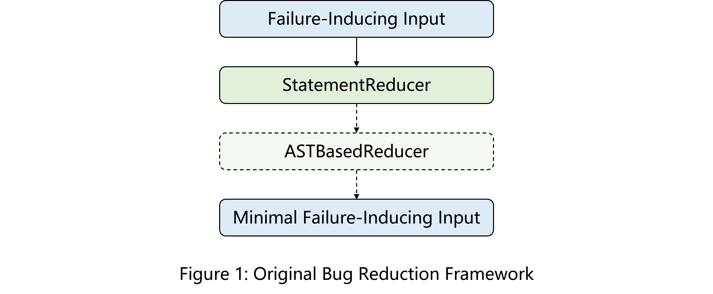
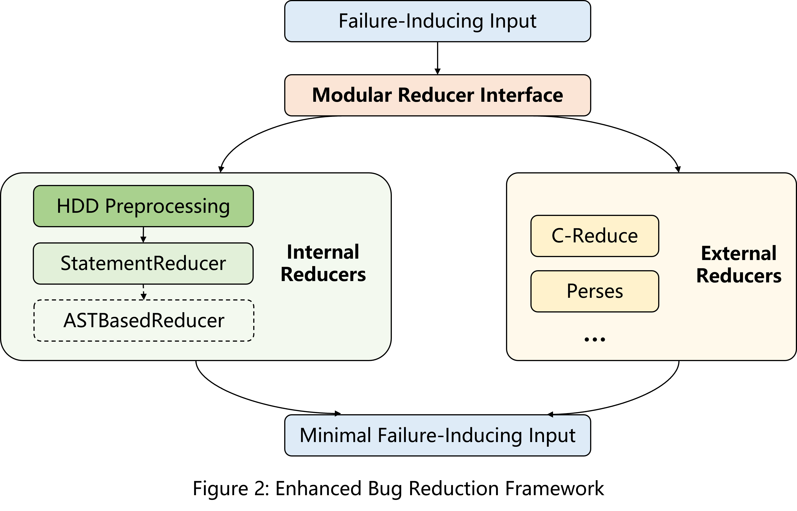
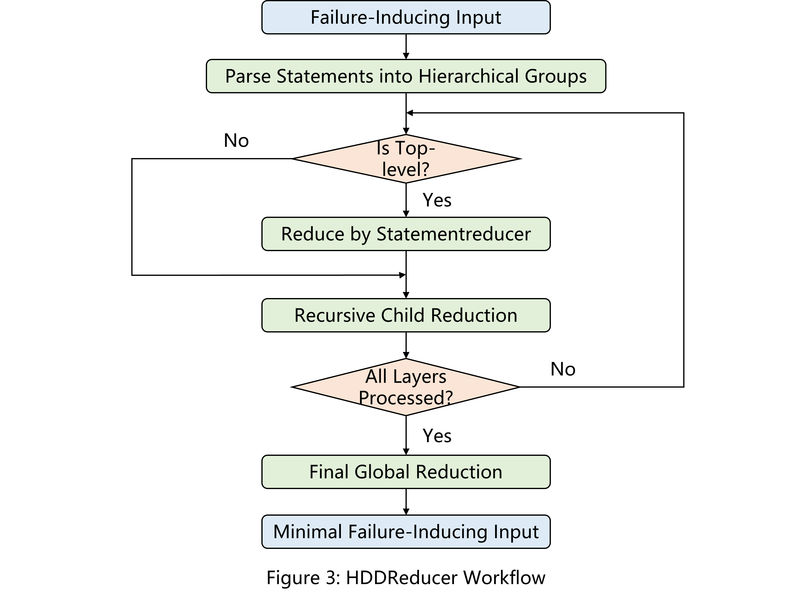

# GSoC 2025 SQLancer Project Proposal

## 1 About Me

- **Name:** Jinhui Xu
- **Email:** jinhuix123@gmail.com
- **Github:** [jinhuix](https://github.com/jinhuix)
- **Blog:** https://jinhuix.github.io
- **Location:** Wuhan, China (UTC+8:00)
- **Education:** M.Sc. in Computer Science, Huazhong University of Science and Technology  

- **Skills:** SQL, Git, Java, Python, C++


## 2 Project Abstract

- **Project Name:** Enhancing SQLancer with External Reducer Support
- **Project Mentor:** [@kabilanma](https://github.com/KabilanMA)
- **Project Community:** SQLancer
- **Expected Size:** Large, 350 hours
- **Project Difficulty:** Medium
- **Objectives:**
  - Develop a modular interface for integrating external reducers.
  - Improve SQLancer’s existing AST-based reduction and DD with HDD preprocessing.
  - Enable seamless integration of reducers like C-Reduce and Perses.
  - **Improve the efficiency and flexibility of SQLancer's bug reduction framework.**

This project aims to modernize SQLancer's test case reduction framework by addressing its current limitations in extensibility and structural awareness. While SQLancer includes experimental delta debugging (`StatementReducer`) and AST-based reduction (`ASTBasedReducer`), these components are tightly coupled, making it challenging to incorporate alternative reduction tools. Historically, integrating external reducers like C-Reduce required manual scripting of test oracles, which limited usability.  

The proposed solution introduces a **modular reducer interface** to decouple reduction strategies from core components, enabling users to seamlessly switch between built-in methods and external tools. Additionally, we will refine existing reducers by implementing **Hierarchical Delta Debugging (HDD)** as a preprocessing step. This hierarchical approach groups SQL statements by logical dependencies (e.g., schema definitions, data operations) before applying reduction, significantly improving efficiency. Finally, adapters for **C-Reduce and Perses** will be developed to leverage their advanced reduction capabilities while aligning with SQLancer's requirements.  


## 3 Project Proposal

### 3.1 Limitations of the Original Reduction Framework

SQLancer's existing reduction framework employs two strategies, as illustrated in Figure 1:  

1. **StatementReducer** (Delta Debugging): Iteratively removes non-essential SQL statements while preserving bug-triggering behavior. 
2. **ASTBasedReducer** :  Reduces test cases at the Abstract Syntax Tree (AST) level.

**Key Limitations:**

1. **Closed Architecture**: Tight coupling between reducers hinders integration with external tools.
2. **Structural Ignorance**: Delta Debugging treats inputs as linear sequences, ignoring hierarchical relationships (e.g., nested queries).
3. **Manual Workflows**: Using external reducers like C-Reduce requires manual scripting of test oracles, limiting automation.
4. **Narrow Applicability:**  Reducers depend on `Reproducer` from `TestOracle.check`, which is unimplemented for most database engines (only SQLite3’s NoREC oracle supports reduction).




### 3.2 Enhanced Reduction Framework Design

The proposed framework (Figure 2) introduces three key improvements:

- **Modular Reducer Interface:** Unified interface for integrating internal and external reducers.
- **Internal Reducers with HDD:** Hierarchical grouping of SQL statements to improve structural awareness.
- **External Reducer Adapters:** Integration of C-Reduce and Perses via automated script generation.



#### 3.2.1 Modular Reducer Interface  

A generic `Reducer<G>` interface allows dynamic selection of reduction strategies via CLI parameters:

```bash
--reducer-type (none|statement|creduce|perses)  # Select reducer type
--reducer-max-steps 1000                        # Global step limit
--reducer-max-time 600                          # Global time limit (seconds)
--reduce-ast                                    # Enable AST optimization post-reduction
```

Reducer configuration in `MainOptions.java`:  

```java
public enum ReducerType { NONE, STATEMENT, CREDUCE, PERSES }
```

Dynamic initialization in Main.java:

```java
private Reducer<G> getReducer(MainOptions options) {
    switch (options.getReducerType()) {
        case NONE:		return null;
        case STATEMENT:	return new HDDReducer<>(provider);	// HDD-preprocessed
        case CREDUCE:	return new CReduceReducer<>();
        case PERSES:	return new PersesAdapter<>();
        default:
            throw new UnsupportedOperationException("Unknown reducer type");
    }
}
```

  Post-Reduction AST optimization by `--reduce-ast` :

```java
Reducer<G> reducer = getReducer(options);
reducer.reduce(state, reproducer, newGlobalState);
if (options.getReducerType() == STATEMENT && options.reduceAST()) {
    new ASTBasedReducer<>(provider).reduce(state, reproducer, newGlobalState);
}
```

#### 3.2.2 Enhanced Internal Reducers with HDD

**1. Hierarchical Grouping** 
SQL statements are categorized into five levels based on logical dependencies:  

```java
public enum SQLHierarchyLevel {  
    SCHEMA_DDL,     // CREATE/ALTER/DROP statements  
    DATA_DML,       // INSERT/UPDATE/DELETE  
    QUERY,          // SELECT/EXPLAIN/UNION  
    EXPRESSION,     // WHERE clauses, JOIN conditions  
    LITERAL         // Constants, function arguments  
}
```

**2. HDDReducer Workflow**  

We optimizes reduction efficiency by **applying DD hierarchically to child nodes** rather than entire input levels. This strategy reduces worst-case complexity **from $O(n^2)$ to $O(nlogn)$** while preserving structural validity. Our implementation follows this principle through three phases:



- Step 1: Parse Input
  - Parse SQL statements into hierarchical groups.  

- Step 2: Breadth-First Reduction (BFS)
  - **Top-Level Prioritization:** Begin with the highest dependency level (e.g., `SCHEMA_DDL` statements like `CREATE TABLE`). Use `StatementReducer` to eliminate redundant schema operations (e.g., unused indexes, optional constraints).
  - **Recursive Child Reduction:** After processing parent groups, recursively invoke `StatementReducer` on child groups.
- Step 3: Final Global Reduction
  - Apply `StatementReducer` to the entire minimized case for further optimization.

**3. Code Snippet (Simplified)**

```Java
public class HDDReducer<G extends GlobalState<?, ?, C>, C extends SQLancerDBConnection>  
        implements Reducer<G> {  

    @Override  
    public void reduce(G state, Reproducer<G> reproducer, G newState) throws Exception {  
        // Step 1: Parse SQL statements into hierarchical groups  
        List<SQLStatement> original = parseStatements(state);  
        List<HierarchyGroup> groups = strategy.group(original);  

        // Step 2: Breadth-First Reduction (BFS)  
        reduceHierarchy(groups, newState, reproducer);  

        // Step 3: Final Global Reduction  
        newState.getState().setStatements(flattenGroups(groups));  
        statementReducer.reduce(newState, reproducer, newState);  
    }  

    private void reduceHierarchy(List<HierarchyGroup> groups, G newState, Reproducer<G> reproducer) {  
        for (int level = 0; level < strategy.maxLevel(); level++) {  
            List<HierarchyGroup> currentLevel = filterGroupsByLevel(groups, level);  
            for (HierarchyGroup group : currentLevel) {  
                // Apply StatementReducer to this group  
                List<SQLStatement> reducedGroup = reduceGroup(group, newState, reproducer);  
                group.setStatements(reducedGroup);  
                // Recurse into child groups
                reduceHierarchy(group.getChildren(), newState, reproducer);  
            }  
        }  
    }  

    private List<SQLStatement> reduceGroup(HierarchyGroup group, G newState, Reproducer<G> reproducer) {  
        newState.getState().setStatements(group.getStatements());  
        statementReducer.reduce(newState, reproducer, newState);  
        return newState.getState().getStatements();  
    }  
}  
```

**4. Example**

Original test case:

```sql
CREATE TABLE t (a INT);  
CREATE INDEX idx ON t(a);		-- Level 1 (SCHEMA_DDL)  
INSERT INTO t VALUES (1);		-- Level 2 (DATA_DML)  
SELECT * FROM t WHERE a = 1;	-- Level 3 (QUERY)  
```

After HDD:

```sql
CREATE TABLE t (a INT);  
SELECT * FROM t WHERE a = 1;  
```

#### 3.2.3 External Reducer Integration

**1. Manual C-Reduce Workflow in Current SQLancer**

Currently, to use C-Reduce in SQLancer's framework, users must manually:

- Capture database states (e.g., schemas, data, configurations) when the bug is first detected.
- Define an interestingness script referencing these states. For example:

```bash
cat interestingness.sh
#!/bin/bash
sqlite3 < test.sql 2>&1 | grep .zq "malformed"
```

This manual process introduces friction and limits automation capabilities, as it relies on the user to correctly capture the system state and write the interestingness script.

**2. Unified CReduceReducer Workflow**

To address these issues, the unified reducer workflow integrates automatic state preservation and leverages C-Reduce to minimize the test case.

- **Step 1: Save System State**
  
  - When the bug is first identified, automatically capture relevant system states (e.g., current database schema, data, configuration settings):

    ```Java
    // Preserve schema, data, and transaction logs  
    SQLStateSnapshot snapshot = state.captureSnapshot();  
    ```
  
  - This snapshot is then used to dynamically generate an interestingness script that ensures the reduced test case still triggers the original bug.
  
- **Step 2: Generate the Interestingness Script**
  
  - Convert the current test case into a SQL file that contains the SQL statements intended for reduction:

    ```java
    Path testCasePath = writeTestCase(state.getStatements());
    ```
  
  - Dynamically generate an interestingness script that uses both the captured snapshot and the generated test SQL file:
  
    ```bash
    # Auto-generated interesting.sh  
    sqlite3 "${snapshot.path}/original.db" < "${test_case}" || exit 1  
    ```
  
- **Step 3: Execute C-Reduce**
  
  - Invoke C-Reduce via `ProcessBuilder`, passing the dynamically generated interestingness script and the test SQL file.
  
- **Step 4: Parse and Validate Output**
  
  - Parse C-Reduce's output into valid `SQLStatement` objects, while preserving associated metadata.
  - Validate the reduced test case against the saved system state to ensure it still triggers the bug.

**3. Code Snippet (Simplified)**

```Java
public class CReduceReducer<G extends GlobalState<?, ?, C>> implements Reducer<G> {
    @Override
    public void reduce(G state, Reproducer<G> reproducer, G newState) throws Exception { 
        // Step 1: Save System State
        SQLStateSnapshot snapshot = state.captureSnapshot();  
        
        // Step 2: Generate the Interestingness Script
        Path testCasePath = writeTestCase(state.getStatements());
        String script = generateScript(snapshot, testCasePath.toString());  
        Path scriptPath = writeToTempFile(script, "interestingness", ".sh");  

        // Step 3: Execute C-Reduce
        ProcessBuilder pb = new ProcessBuilder("creduce", scriptPath.toString(), testCasePath.toString());  
        Process process = pb.start();  
          
        // Step 4: Parse and Validate Output
        List<SQLStatement> reduced = parseCReduceOutput(process.getInputStream());  
        newState.getState().setStatements(reduced);  
        if (!validateAgainstSnapshot(reduced, snapshot)) {  
            throw new ReductionValidationException("Bug not retained after reduction!"); 
        }  
    }
}

    private String invokeCReducer(String interestingScriptFile, String testCaseFile)
            throws IOException, InterruptedException {
         ProcessBuilder pb = new ProcessBuilder("creduce", interestingScriptFile, testCaseFile);
         Process process = pb.start();
         String output;
         try (BufferedReader reader = new BufferedReader(new InputStreamReader(process.getInputStream()))) {
             output = reader.lines().collect(Collectors.joining("\n"));
         }
         int exitCode = process.waitFor();
         if (exitCode != 0) {
             throw new RuntimeException("creduce exited with error code: " + exitCode);
         }
         return output;
    }
```

#### 3.2.4 Tests and Evaluation

**1. Correctness Testing**  

- Validation with Complex SQL Cases: Verify the HDD grouping logic using complex SQL scenarios (e.g., nested queries, transactions, subqueries, and union queries) to ensure that the hierarchical grouping and recursive reduction maintain the bug-triggering conditions.
- Cross-Database Validation: Test external reducer integrations (C-Reduce and Perses) across multiple database engines (e.g., SQLite, MySQL, PostgreSQL) to ensure that the reduced test case reliably reproduces the bug in diverse environments.

**2. Performance Benchmarking**  

- Reduction Efficiency Comparison: Benchmark the reduction time and effectiveness by comparing different configurations: the baseline approach (original DD + AST), HDD-preprocessed DD + AST, and external reducers (C-Reduce/Perses). Metrics will include reduction speed, minimized SQL statement size, and resource consumption.
- Load and Scalability Testing: Simulate large-scale SQL test cases to assess the stability and scalability of the reducer framework under heavy load, ensuring robustness in real-world scenarios.

**3. Edge Case Handling**

- Handling Exceptional Scenarios: Develop dedicated test cases for invalid inputs, formatting errors, and extreme scenarios to ensure that the reducer gracefully handles edge cases, with clear fallback or error messaging when bug reproduction fails.
- Automated Verification: Integrate an automated validation mechanism that runs the interestingness test after reduction to confirm that the minimized test case still triggers the target bug.


## 4 Deliverables

- **Modular Reducer Interface:**
  A flexible, pluggable interface that supports both internal and external reducers, making it easy to extend and maintain.
- **HDD-Preprocessed Reducers:**
  A robust implementation utilizing Hierarchical Delta Debugging (HDD) to structure and minimize SQL input effectively, ensuring precise bug reproduction.
- **Integration of C-Reduce and Perses:**
  Optional yet powerful external reduction tools integrated into the framework, providing users with multiple strategies for test case minimization.
- **Comprehensive Test Suite:**
  A thorough collection of test cases covering hierarchical reduction, integration scenarios, and edge case handling to validate the new functionality across different environments.
- **Detailed Documentation:**
  Extensive documentation on reducer configuration, extension methods, usage examples, and performance tuning to ensure a smooth onboarding process for both users and developers.


## 5 Timeline

| Phase         | Dates             | Tasks                                                        |
| ------------- | ----------------- | ------------------------------------------------------------ |
| Development 1 | 06.02 – 06.15     | Design a modular, pluggable reducer interface; refactor existing reducers for better extensibility and maintainability. |
| Development 2 | 06.15 – 06.29     | Develop the C-Reduce adapter; integrate it into SQLancer to automate interestingness testing. |
| Development 3 | 06.30 – 07.13     | Implement HDD preprocessing and hierarchical reduction to optimize SQL grouping and recursive minimization logic. |
| **Midterm**   | **07.14 – 07.20** | **Submit a comprehensive midterm report including progress updates, initial performance benchmarks, and design refinements.** |
| Development 4 | 07.21 – 08.03     | Develop the Perses adapter; optimize the script generation mechanism to enhance automation and robustness. |
| Testing       | 08.04 – 08.17     | Develop extensive test cases; perform benchmarking to evaluate the performance and effectiveness of the reduction strategies. |
| Documentation | 08.18 – 08.31     | Finalize detailed documentation; prepare user guides, developer manuals, and demonstration materials. |
| **Final**     | **09.01 – 09.07** | **Submit the final work product, including complete code integration, comprehensive documentation, and performance benchmarks.** |


## 6 Contributions to SQLancer

- **Merged PR:** 
  - [#1178](https://github.com/sqlancer/sqlancer/pull/1178) – Resolved [#1115](https://github.com/sqlancer/sqlancer/issues/1115) by adding comprehensive unit tests for schema classes.
- **Under Review:** 
  - [#1145](https://github.com/sqlancer/sqlancer/pull/1145) – Proposed a unified reducer interface to streamline integration and enhance modularity.
- **Issue Formulation:**
  - [#1138](https://github.com/sqlancer/sqlancer/issues/1138) – Initiated discussions on the design and implementation of the reducer interface.
  - [#1186](https://github.com/sqlancer/sqlancer/issues/1186) – Identified that NoREC for SQLite3 currently lacks reducer support and provided initial solutions.
- **Community Engagement:** 
  - Actively participated in the SQLancer Slack channel, offering support and guidance to newcomers and contributing to technical discussions.

Additionally, I have expanded my knowledge on DD and HDD principles, and detailed notes are available on my [blog](https://jinhuix.github.io). While my current contributions as a newcomer are modest, I am committed to increasing my engagement with the SQLancer community and continuing to contribute valuable improvements in the future.


## 7 Reference

- SQLancer GitHub: https://github.com/sqlancer/sqlancer
- C-Reduce Tutorial: https://www.youtube.com/watch?v=vkfdYyn40Qw
- C-Reduce GitHub: https://github.com/csmith-project/creduce
- Perses Tool: https://github.com/uw-pluverse/perses
- DD: https://www.debuggingbook.org/html/DeltaDebugger.html
- HDD: [Hierarchical Delta Debugging](https://users.cs.northwestern.edu/~robby/courses/395-495-2009-fall/hdd.pdf)
